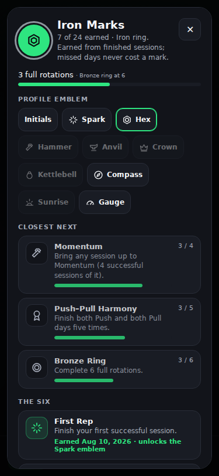
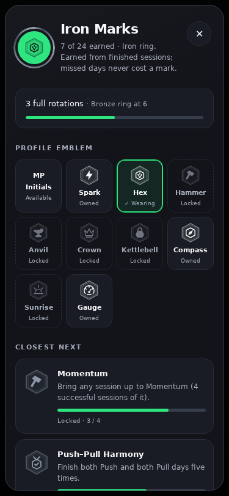
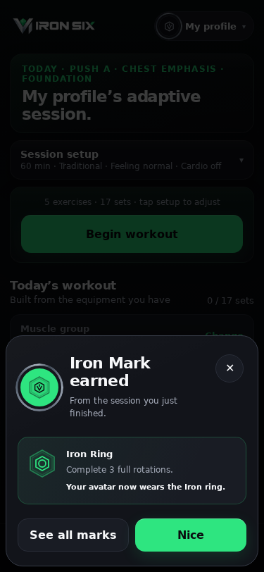
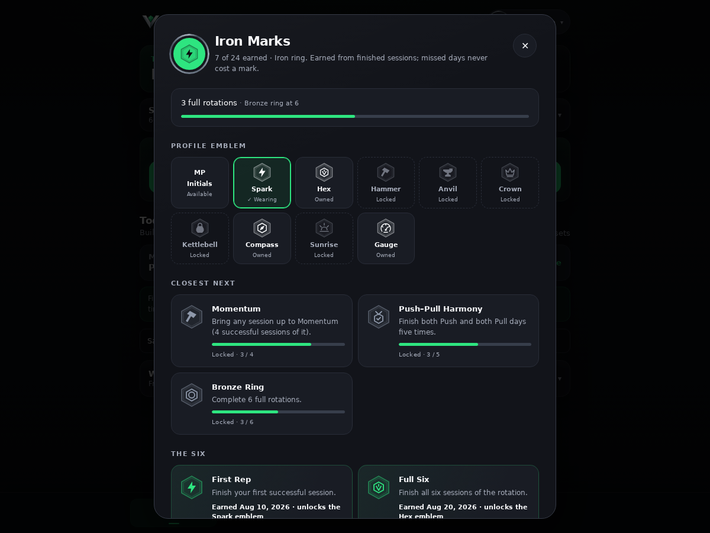
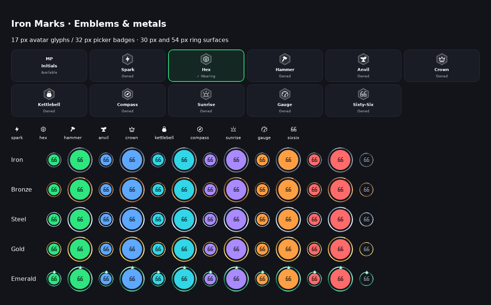

# Iron Marks visual upgrade

Implemented on `feature/iron-marks`, continuing the self-contained Claude handoff. Production is not merged.

## Changes

- Ten cohesive emblem glyphs, two generic achievement glyphs, and a concealed-mark glyph. Bold silhouettes at 17 px; double-hex badge surrounds at 32–40 px.
- Five fixed metallic ring treatments independent of profile accent; Emerald has a small stationary faceted crown point.
- Mobile trophy case with a four-column emblem selector, explicit Wearing/Owned/Locked labels, pressed-button semantics, and clear earned/locked/hidden cards.
- Restrained 520 ms celebration reveal, disabled under reduced motion. No observers, continuous animation, extra assets, or network requests.
- Profile-menu refresh preserves an existing worn SVG instead of destroying it every 1.5 seconds; removing or losing an emblem restores initials.
- Achievement rules, IDs, storage and engine are unchanged. Runtime changes are limited to iron-marks.js and the profile-menu avatar repaint line.

## Verification

- `npm test`: 392 passed, 0 failed, including avatar node-identity and initials-restoration regression.
- `node scripts/build-web.mjs`: passed.
- `node scripts/build-android-web.mjs`: passed.
- Headless Chromium on the actual local app: 375×812 trophy case has no horizontal overflow; wear button updates aria-pressed; Escape closes; all ten earned emblems can be worn; reduced-motion computed animation is `none`.
- Inspected mobile trophy case, mobile celebration, desktop trophy case, all ten small glyphs and all five ring treatments against six accents plus guest. Screenshots use synthetic local history, not account data.
- Browser CLI was unavailable; used Playwright with locally extracted Chromium. No browser dependencies were added to the application.
- Screenshots are report-only files and are not copied into the web/Android release bundles. Runtime source growth is only a few KB.

## Screenshots

| Before, 375×812 | After, 375×812 |
| --- | --- |
|  |  |

Preview alias: https://iron-six-training-git-feature-i-648168-jordman55-3386s-projects.vercel.app/

The preview may require the owner's Vercel sign-in. Real-device review remains useful before choosing to merge.
